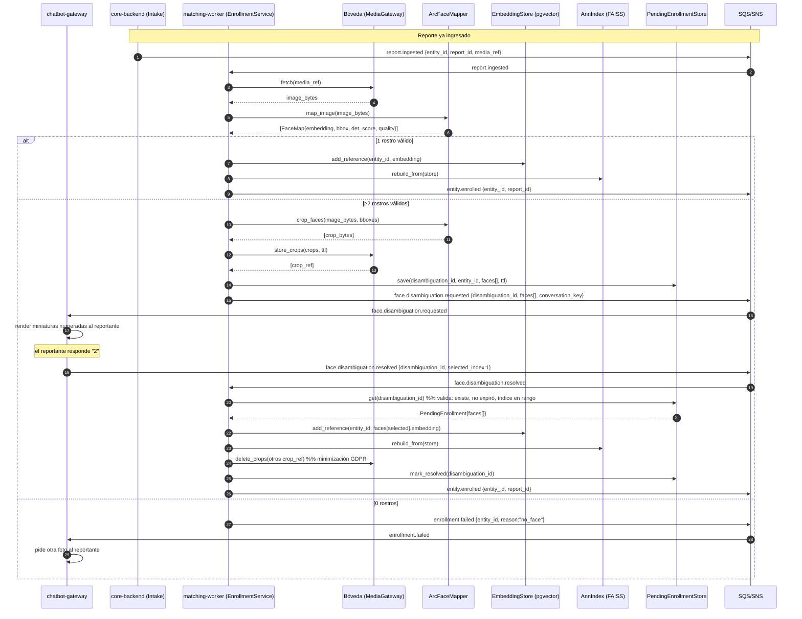

# Diseño: enrolamiento biométrico y desambiguación multi-rostro

> Fase AI-DLC 02-design → 03-implementation. Implementa [ADR-0016](../../../docs/00-project/adr/0016-enrolamiento-biometrico-desambiguacion.md).
> Reutiliza ArcFace 512-d ([ADR-0013](../../../docs/00-project/adr/0013-arcface-scoring-solo-rostro.md)),
> la bóveda ([ADR-0005](../../../docs/00-project/adr/0005-webhook-manager-vault-worker.md)/[ADR-0008](../../../docs/00-project/adr/0008-boveda-llaves-identidad.md)),
> el sobre de eventos ([ADR-0011](../../../docs/00-project/adr/0011-contrato-eventos.md)) y el broker SQS/SNS ([ADR-0012](../../../docs/00-project/adr/0012-broker-aws-sqs-sns.md)).

## 1. Problema

Una entidad provisional creada por el `IntakeService` no tiene huella biométrica en el índice. Hay
que **enrolar** el rostro del sujeto desde la foto de referencia del reporte. Las fotos reales suelen
tener **más de un rostro**, y solo el reportante sabe cuál es el desaparecido. Los demás rostros son
terceros que no consintieron y no deben retenerse.

Objetivo: cargar una foto → detectar rostros + embeddings → enrolar y enlazar al sujeto; si hay
varios rostros, **preguntar al reportante** cuál es; descartar el resto sin retenerlo.

## 2. Disparadores y ramas

El `EnrollmentService` (capa de aplicación, `matching-worker`) consume dos eventos:

```
report.ingested  ─────────────►  detectar rostros ─┬─ 0 rostros ─► enrollment.failed (no_face)
                                                    ├─ 1 rostro  ─► add_reference ─► entity.enrolled
                                                    └─ ≥2 rostros ─► face.disambiguation.requested
                                                                       (NO enrola; crea PendingEnrollment)

face.disambiguation.resolved ──►  selected_index   ─► add_reference(rostro elegido) ─► entity.enrolled
                                  none_of_these     ─► enrollment.failed (no_subject_in_photo)
                                  (en ambos casos) ──► purgar recortes + embeddings no elegidos + pendiente
```

Regla de calidad: solo se cuentan/ofrecen rostros que superan `QualityThresholds` (lado ≥ `min_size_px`,
nitidez ≥ `min_blur_var`). Caras de fondo diminutas se filtran antes de contar (evita preguntar por
ruido).

## 3. Diagrama de secuencia



## 4. Modelo de dominio (cambios)

`FaceMap` se extiende con la geometría que hoy `_to_facemap` descarta. Todo `frozen` (inmutable).

```python
@dataclass(frozen=True)
class BBox:
    x1: int; y1: int; x2: int; y2: int
    @property
    def width(self) -> int: return self.x2 - self.x1
    @property
    def height(self) -> int: return self.y2 - self.y1

@dataclass(frozen=True)
class FaceMap:
    embedding: tuple[float, ...]   # 512-d normalizado (ADR-0013)
    quality: FaceQuality
    bbox: BBox                     # NUEVO: para recortar y ubicar
    det_score: float = 0.0         # NUEVO: confianza del detector SCRFD

@dataclass(frozen=True)
class PendingFace:
    index: int
    embedding: tuple[float, ...]
    bbox: BBox
    det_score: float
    crop_ref: str | None = None    # referencia en la bóveda

@dataclass(frozen=True)
class PendingEnrollment:
    disambiguation_id: str
    entity_id: str
    report_id: str | None
    faces: tuple[PendingFace, ...]
    conversation_key: str | None   # para que el chatbot responda al reportante (ADR-0015)
    created_at: str
    expires_at: str
    status: str = "pending"        # pending | resolved | expired
```

## 5. Puertos nuevos (hexagonal)

Se añaden a `application/ports.py`. Adaptadores concretos en fase 03.

```python
class MediaGateway(Protocol):
    """Acceso a adjuntos cifrados de la bóveda (ADR-0005/0008)."""
    def fetch(self, media_ref: str) -> bytes: ...
    def store_crops(self, crops: list[bytes], ttl_seconds: int) -> list[str]: ...  # → crop_refs
    def delete_crops(self, crop_refs: list[str]) -> None: ...

class PendingEnrollmentStore(Protocol):
    """Persistencia de desambiguaciones en curso (Postgres, con TTL)."""
    def save(self, pending: PendingEnrollment) -> None: ...
    def get(self, disambiguation_id: str) -> PendingEnrollment | None: ...
    def mark_resolved(self, disambiguation_id: str) -> None: ...
    def purge_expired(self, now_iso: str) -> int: ...

class GrantRevoker(Protocol):
    """Revoca las concesiones del media-gateway (ADR-0017) al purgar los recortes. Best-effort: si
    falla, el TTL corto de la concesión es el respaldo (§6)."""
    def revoke_grants(self, *, report_id: str | None, media_refs: list[str]) -> None: ...
```

Al resolver/expirar/`none_of_these`, el `EnrollmentService` purga los recortes **y** revoca por lote
las concesiones (`POST /grants:revoke-by-ref {report_id}`, o por `media_ref` si no hay `report_id`)
vía `HttpGrantRevoker`. Es opcional: sin `MEDIA_GATEWAY_URL` configurada, la purga de recortes igual ocurre.

`FaceMapper` gana una capacidad de recorte (en el adaptador de visión, opera sobre el array decodificado):

```python
def crop_faces(self, image_bytes: bytes, bboxes: list[BBox]) -> list[bytes]: ...
```

Se reutilizan sin cambios: `EmbeddingStore`, `AnnIndex`, `EventBus`.

## 6. Esquemas de eventos (sobre ADR-0011, nombres `domain.event` en inglés)

Todos viajan en el sobre estándar (`event_id`, `event_type`, `producer`, `timestamp`, `version`,
`payload`). Aquí solo se describe el `payload`.

**`entity.enrolled`** — producer `matching-worker`. El sujeto ya tiene huella en el índice; puede
disparar re-matching de reportes de "encontrado" previos.
```json
{ "entity_id": "ent_…", "report_id": "rep_…", "face_quality": {"size_px": 220, "blur_var": 130.4},
  "det_score": 0.94, "source": "report.ingested" }
```

**`enrollment.failed`** — producer `matching-worker`. El chatbot pide acción al reportante.
```json
{ "entity_id": "ent_…", "report_id": "rep_…",
  "reason": "no_face | low_quality | no_subject_in_photo | expired | invalid_selection",
  "conversation_key": "…" }
```

> **Render de los rostros en el chat (ADR-0017):** el evento lleva el `crop_ref` interno (puntero a
> la bóveda), **no** una URL pública. Quien entrega el medio al reportante (`chatbot-gateway` →
> `output-service`) pide al **media-gateway** una concesión sobre cada `crop_ref` en el momento del
> envío (`POST /grants`, `purpose=disambiguation_crop`, `audience=meta_fetchers`) y manda a Meta la
> **URL firmada** como `link`. Al resolver/expirar la desambiguación se revocan esas concesiones
> (`POST /grants:revoke-by-ref {report_id}`) junto con la purga de los recortes.

**`face.disambiguation.requested`** — producer `matching-worker` → consume `chatbot-gateway`.
```json
{ "disambiguation_id": "dis_…", "entity_id": "ent_…", "report_id": "rep_…",
  "conversation_key": "…", "expires_at": "2026-06-27T18:30:00Z",
  "faces": [
    { "index": 0, "crop_ref": "vault://crop/…", "bbox": [120,80,210,190], "det_score": 0.95 },
    { "index": 1, "crop_ref": "vault://crop/…", "bbox": [330,72,430,200], "det_score": 0.91 }
  ] }
```

**`face.disambiguation.resolved`** — producer `chatbot-gateway` → consume `matching-worker`.
```json
{ "disambiguation_id": "dis_…", "selected_index": 1 }
// o, si el sujeto no está en la foto:
{ "disambiguation_id": "dis_…", "action": "none_of_these" }
```

## 7. Casos borde e idempotencia

- **Entrega at-least-once (ADR-0012):** `report.ingested` duplicado → `add_reference` es upsert por
  `entity_id`, no duplica. `face.disambiguation.resolved` duplicado → si el pendiente ya está
  `resolved`, no-op.
- **Índice fuera de rango** en `selected_index` → `enrollment.failed (invalid_selection)`, no se enrola.
- **Pendiente expirado** (pasó `expires_at`) → `purge_expired` borra recortes; un `resolved` tardío
  responde `enrollment.failed (expired)` y pide reenviar la foto.
- **0 rostros / baja calidad** → `enrollment.failed`; el chatbot guía al reportante a mandar una foto
  más nítida y de frente.
- **`none_of_these`** → `enrollment.failed (no_subject_in_photo)` + purga; se solicita otra foto.
- **Minimización (A04):** los embeddings y recortes de rostros **no elegidos nunca** llegan al
  `EmbeddingStore`/índice; viven solo en `PendingEnrollment` + bóveda efímera y se purgan al resolver
  o expirar. Atención a menores entre los no-sujetos: no se retienen.
- **Auditoría (A08/A09):** cada `entity.enrolled`, `enrollment.failed` y purga se registran en la
  auditoría encadenada (como en `core-backend`).

## 8. Wiring (resumen)

`__main__.py` del worker añade un consumidor para `report.ingested` y otro para
`face.disambiguation.resolved`, ambos hacia `EnrollmentService`. El servicio recibe por inyección:
`FaceMapper`, `MediaGateway`, `EmbeddingStore`, `AnnIndex`, `PendingEnrollmentStore`, `EventBus`,
`QualityThresholds` y `GrantRevoker` (opcional, `HttpGrantRevoker` si `MEDIA_GATEWAY_URL` está
configurada). Un job programado invoca `purge_expired` (alinear ventana con ADR-0007/0015).

> **Modelo en dev (S3/MinIO):** el `MediaGateway` lee/escribe S3 vía `AWS_ENDPOINT_URL_S3` (MinIO
> persistente en local). El binario se lee **sin descifrar** (el `vault-worker` guarda passthrough en
> dev); en prod faltará inyectar el descifrado de sobre (ADR-0008). El modelo ArcFace (`buffalo_l`) se
> cachea en el volumen `/models`.

## 9. Plan de implementación (fase 03, TDD)

1. Extender `domain/models.py` (`BBox`, `FaceMap.bbox/det_score`, `PendingFace`, `PendingEnrollment`).
2. Puertos en `application/ports.py` (`MediaGateway`, `PendingEnrollmentStore`) + `crop_faces`.
3. `application/enrollment_service.py` con la lógica de ramas (tests con fakes en memoria, sin GPU).
4. Adaptadores: `vault_media_gateway.py`, `pg_pending_enrollment_store.py`; `crop_faces` en
   `arcface_facemapper.py` (devolver `bbox`/`det_score` en `_to_facemap`).
5. Registrar los 4 eventos en `docs/02-design/asyncapi.yaml`.
6. Wiring en `__main__.py` + job de purga.
