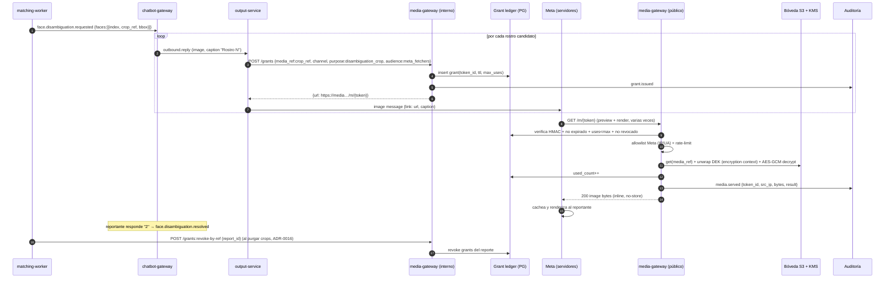

# Diseño: media-gateway (entrega de medios por URL firmada)

> Fase AI-DLC 02-design → 03-implementation. Implementa
> [ADR-0017](../../../docs/00-project/adr/0017-media-delivery-gateway.md).
> Reutiliza la bóveda cifrada ([ADR-0005](../../../docs/00-project/adr/0005-webhook-manager-vault-worker.md)/[ADR-0008](../../../docs/00-project/adr/0008-boveda-llaves-identidad.md)),
> residencia São Paulo ([ADR-0006](../../../docs/00-project/adr/0006-residencia-sao-paulo.md)),
> auditoría ([ADR-0007](../../../docs/00-project/adr/0007-esquema-reporte-retencion-auditoria.md)) y
> despliegue EKS/ALB ([ADR-0014](../../../docs/00-project/adr/0014-contenedores-despliegue-eks.md)).

## 1. Problema

Para que el reportante elija un rostro (ADR-0016) o un coordinador vea la foto del desaparecido, Meta
debe **renderizar** la imagen en el chat. Meta renderiza descargando un **`link` HTTPS**. Pero el
medio vive **cifrado** en S3 (sobre DEK por sujeto, ADR-0008), escaneado (ADR-0005) y en São Paulo
(ADR-0006); el `media_ref` (`s3://…`) **no es servible**. Hace falta un punto que exponga el binario
de forma **controlada, efímera y auditada**, transversal a todos los canales y propósitos.

## 2. Modelo de concesión (`grant`)

Una concesión autoriza **un** `media_ref` por **una** ventana corta. Es la unidad de control.

```
Grant
├── token_id        : 128-bit aleatorio (base64url)        → forma el path /m/{token}
├── sig             : HMAC_KMS(token_id | exp)             → rechazo barato de manipulación
├── media_ref       : s3://bucket/media/{subject}/{id}     → NUNCA viaja en la URL
├── audience        : meta_fetchers | authenticated_session | open_token
├── purpose         : disambiguation_crop | report_photo | proof_of_life | attachment
├── content_type    : image/jpeg | image/png | video/mp4 …
├── max_uses        : N pequeño (def. por propósito)       → tolera multi-descarga de Meta
├── used_count      : contador (ledger)
├── expires_at      : minutos (def. por propósito)
├── revoked_at      : null | timestamp
├── created_by      : servicio emisor (output-service/chatbot/back-office)
└── created_at
```

El **token es opaco**: no contiene `media_ref` ni PII. El **ledger** (Postgres, sa-east-1) es la
autoridad de `used_count`/`revoked_at`/`expires_at`; el HMAC solo permite descartar basura sin tocar
la BD. Valores iniciales sugeridos (recalibrar, ADR-0017 §Pendiente):

| purpose | audience | TTL | max_uses |
|---|---|---|---|
| disambiguation_crop | meta_fetchers | 10 min | 3 |
| report_photo (back office) | authenticated_session | 15 min | 10 |
| proof_of_life (video) | meta_fetchers | 10 min | 3 (+ Range) |

> **Nota "uso único":** Meta descarga el `link` varias veces (preview + render + reintentos). Por eso
> `max_uses` es un N bajo, no 1; como Meta **cachea** el medio en su CDN tras descargarlo, el efecto
> al usuario es de entrega única. Casos estrictos pueden fijar `max_uses=1`.

## 3. Planos y endpoints

### Plano público (tras ALB + WAF)

```
GET  /m/{token}        → 200 bytes | 403 | 404 | 410 | 429
HEAD /m/{token}        → cabeceras (Meta a veces hace HEAD antes de GET)
```
- **200**: `Content-Type` del grant, `Content-Disposition: inline`, `Cache-Control: private, no-store`,
  soporta `Range` para video. Cuerpo = bytes **descifrados** en streaming.
- **403**: allowlist falla (IP/UA no es fetcher de Meta para `audience=meta_fetchers`), grant revocado.
- **404**: token inexistente o HMAC inválido (indistinguible, anti-enumeración).
- **410**: expirado o `used_count >= max_uses`.
- **429**: rate-limit por token/IP/global superado.

### Plano interno (mesh privado, IRSA/mTLS — nunca expuesto)

```
POST   /grants                 {media_ref, channel, purpose, audience?, ttl_s?, max_uses?}
                               → 201 {url, token_id, expires_at}
DELETE /grants/{token_id}      → 204  (revoca)
POST   /grants:revoke-by-ref   {media_ref | report_id | entity_id} → 204  (revoca en lote)
```
Lo llaman `output-service`, `chatbot-gateway` y el back office **en el momento de enviar**, para que
el TTL sea mínimo.

## 4. Flujo end-to-end (desambiguación, ADR-0016)



Para **back office**, el mismo `POST /grants` con `audience=authenticated_session`: el navegador del
coordinador (sesión Auth0, ADR-0009) descarga `/m/{token}` y el gateway valida la sesión en vez del
allowlist de Meta.

## 5. Puertos (hexagonal)

```python
class MediaStore(Protocol):                 # lectura de la bóveda (reusa contrato de vault-worker)
    def get(self, media_ref: str) -> tuple[bytes, dict]: ...   # (ciphertext, metadata: scan, ct, subject)

class EnvelopeCipher(Protocol):             # ADR-0008
    def decrypt(self, ciphertext: bytes, metadata: dict) -> bytes: ...

class GrantStore(Protocol):                 # ledger en Postgres
    def create(self, grant: Grant) -> None: ...
    def get(self, token_id: str) -> Grant | None: ...
    def consume(self, token_id: str) -> bool: ...     # ++used_count atómico; False si agotado/expirado
    def revoke(self, token_id: str) -> None: ...
    def revoke_by_ref(self, *, media_ref=None, report_id=None, entity_id=None) -> int: ...
    def purge_expired(self, now_iso: str) -> int: ...

class TokenSigner(Protocol):                # HMAC con clave en KMS/Vault (ADR-0008)
    def sign(self, token_id: str, exp: int) -> str: ...
    def verify(self, token_id: str, exp: int, sig: str) -> bool: ...

class FetcherAllowlist(Protocol):           # rangos IP / User-Agent de Meta
    def is_allowed(self, audience: str, src_ip: str, user_agent: str) -> bool: ...

class RateLimiter(Protocol):                # Redis (ya en stack del output-service)
    def hit(self, key: str) -> bool: ...

class AuditLog(Protocol):                   # cadena SHA-256 (ADR-0007)
    def record(self, event: str, data: dict) -> None: ...
```

`GET /m/{token}` orquesta: `verify` (HMAC) → `allowlist` → `rate-limit` → `GrantStore.consume` →
`MediaStore.get` (solo `scan=clean`) → `EnvelopeCipher.decrypt` → stream → `AuditLog`. Falla cerrado
en cualquier paso.

## 6. Cambio en `output-service`

Hoy solo `send_text`/`send_template`. Se añade `send_image(bot_id, channel, contact_ref, link, caption)`
(y `send_video`) que arma el mensaje de imagen de la Graph API con `link` = URL firmada. Respeta la
ventana de servicio de 24h ya implementada.

## 7. Seguridad (resumen threat model)

- **A01 acceso al objeto:** token opaco, sin `media_ref`; el ledger ata token→un solo `media_ref`.
- **A02 cripto del token:** `token_id` 128-bit + HMAC con clave en KMS/Vault; rotación de clave.
- **A04 exposición de PII:** TTL de minutos, `max_uses` bajo, revocable, `no-store`; la PII solo sale
  en la descarga puntual de Meta sobre URL efímera y auditada.
- **A05 borde público:** ALB+WAF; allowlist de fetchers de Meta para `meta_fetchers`; solo `GET/HEAD`;
  sin listado; `404` indistinguible para token inválido/inexistente.
- **A08 integridad de datos:** sirve solo `scan=clean`; *encryption context* por sujeto (ADR-0008).
- **A09 auditoría:** `grant.issued`, `grant.revoked`, `media.served` (con `src_ip`, `ua`, `bytes`,
  resultado) en la cadena SHA-256; rate-limit por token/IP/global.
- No hay **SSRF** (el gateway no descarga URLs provistas por el usuario).

## 8. Despliegue

App stateless (FastAPI/uvicorn) en EKS (ADR-0014): ALB+WAF + HPA para el plano público; `Service`
interno (sin Ingress) para el plano de concesiones; IRSA con permiso `s3:GetObject` +
`kms:Decrypt` (encryption context) **solo lectura**; Postgres (ledger) y Redis (rate-limit) en
sa-east-1. Job programado `purge_expired`. Imagen OCI no-root.

## 9. Plan de implementación (fase 03, TDD)

1. Dominio: `Grant`, políticas por `purpose` (TTL/max_uses/audience).
2. Puertos (§5) + adaptadores: `PgGrantStore`, `KmsTokenSigner`, `S3MediaStore`+`KmsEnvelopeCipher`
   (reusar los de `vault-worker` en modo lectura), `MetaFetcherAllowlist`, `RedisRateLimiter`,
   `ChainedAuditLog`.
3. App FastAPI: `GET/HEAD /m/{token}` (público) y `POST/DELETE /grants` (interno), con *fail-closed*.
4. `send_image`/`send_video` en `output-service`.
5. Tests: firma/verificación, expiración, agotamiento de usos, revocación, allowlist, solo-clean,
   rate-limit, descifrado (con cipher fake), y el flujo de desambiguación con fakes en memoria.
6. Deploy: kustomize (Ingress público + Service interno), IRSA, job de purga.
