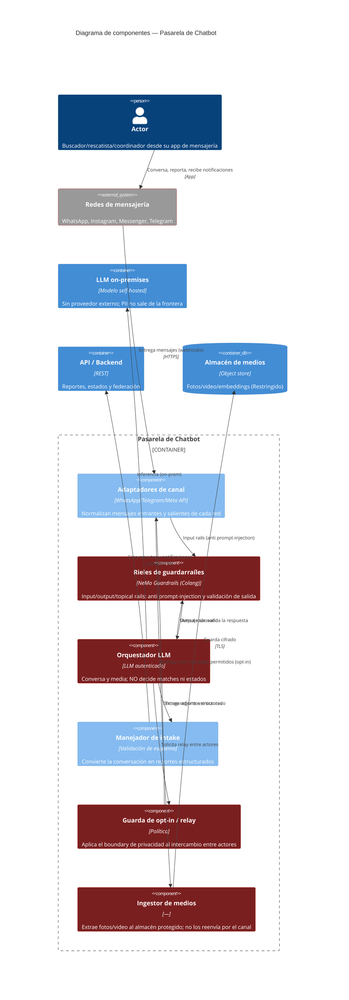

# C4 — Diagrama de Componentes: Pasarela de Chatbot · Respuesta

> **C4 — Component view · AI-DLC Fase 02 (Design)**
>
> Cómo se construye por dentro el canal principal. El chatbot opera a través de varias redes de
> mensajería y un LLM autenticado que conversa y media el intercambio entre actores. Reglas de
> diseño marcadas en rojo: el LLM **no es autoritativo** (no decide matches ni estados), los medios
> entrantes se ingieren al almacén protegido y **no se reenvían** por la red social, y el relay
> entre actores respeta el opt-in.

## Notas de seguridad

Toda entrada por mensajería es **superficie no confiable**: alimenta el orquestador LLM, por lo que
el manejo de prompt injection es obligatorio (RS-13, AB-07 → OWASP A05). Los **rieles de
guardarraíles (NeMo Guardrails)** aplican input rails (anti-jailbreak), topical/dialogue rails y
output rails alrededor del LLM — ver [ADR-0002](../00-project/adr/0002-nemo-guardrails-prompt-injection.md).
Es **defensa en profundidad, no garantía**: el backstop sigue siendo que el LLM no es autoritativo y
no puede mover estados. El **ingestor de medios** materializa la regla de no
exponer biométricos: extrae los adjuntos al almacén protegido y nunca los reenvía por la red social;
el proof-of-life se reproduce en el portal mediante un **link asegurado por login**, nunca como
video compartible en el chat. La **guarda de opt-in/relay** evita que el intercambio mediado por el
LLM filtre identidades o conecte actores sin consentimiento (AB-01). El **LLM es on-premises**, así
que la conversación con PII no sale de la frontera. Las **redes de mensajería** (Meta, Telegram)
siguen siendo procesadores externos del medio en tránsito: requieren DPA y no se les reenvía la
carga biométrica. La cola **nativa del dispositivo** (p. ej. WhatsApp) sostiene el envío offline
del rescatista certificado sin necesidad de instalar una app.
