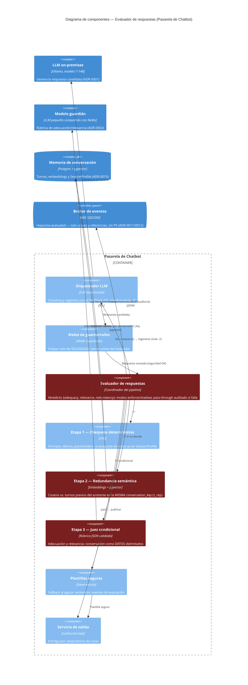

# C4 — Diagrama de Componentes: Evaluador de respuestas del chatbot · Respuesta

> **C4 — Component view · AI-DLC Fase 02 (Design)**
>
> Pipeline escalonado de calidad conversacional ([ADR-0022](../00-project/adr/0022-evaluador-respuestas-chatbot.md)):
> toda respuesta generada por el LLM pasa, tras los output rails de NeMo
> ([ADR-0002](../00-project/adr/0002-nemo-guardrails-prompt-injection.md)), por tres etapas —
> chequeos deterministas, redundancia semántica sobre pgvector
> ([ADR-0015](../00-project/adr/0015-memoria-conversacion-pgvector.md)) y juez LLM condicional —
> antes de publicarse en `outbound.reply`. Veredicto negativo → regeneración con feedback (máx. 2)
> → plantilla segura. En rojo las reglas duras: el evaluador **veta pero no edita ni mueve
> estados**, la redundancia **no cruza conversaciones** y los eventos de auditoría **no llevan
> texto ni PII**.

## Notas de seguridad

El evaluador es una capa de **calidad**, no de seguridad: corre **después** de los output rails de
NeMo y **no los reemplaza** (A06). No es autoritativo — veta y explica, pero no edita respuestas ni
mueve estados; el backstop arquitectónico "LLM no autoritativo" ([ADR-0001](../00-project/adr/0001-llm-on-premises.md))
se preserva. El **juez condicional** es superficie nueva de prompt injection indirecta (el texto
del usuario viaja citado en el contexto de evaluación): recibe la conversación como **datos
delimitados** con rúbrica fija y su salida se valida contra esquema JSON (A05, `ai-sec`). La
**redundancia semántica** consulta pgvector estrictamente filtrada por `conversation_key` — cruzar
conversaciones sería una fuga entre interlocutores (A01) y se cubre con test de aislamiento. Los
eventos `response.evaluated` llevan **solo scores, referencias y contadores**, nunca texto de la
conversación (A04). Veredictos, reintentos, fallbacks, pass-through por fallo del evaluador y
cambios de modo enforce↔shadow quedan **auditados** (A09); la tasa de fallback es alarma operativa
y el tope de 2 regeneraciones acota el consumo de la GPU compartida bajo pico
([ADR-0001](../00-project/adr/0001-llm-on-premises.md)/[ADR-0018](../00-project/adr/0018-desacople-gpu-llm-facematch.md)).
