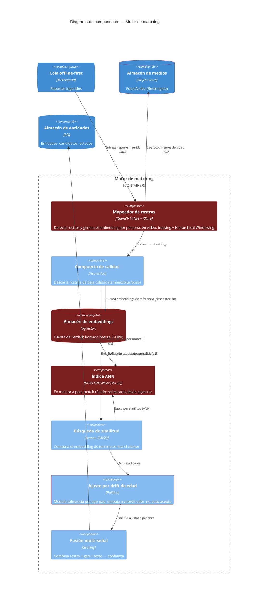

# C4 — Diagrama de Componentes: Motor de Matching · Respuesta

> **C4 — Component view · AI-DLC Fase 02 (Design)**
>
> Cómo se construye por dentro el motor de matching. Por cada reporte de desaparecido se mapea el
> rostro (OpenCV YuNet + SFace) y se guardan los embeddings de referencia; cuando llega una foto o
> video del rescatista se busca por similitud contra el clúster, se **ajusta por drift de edad**
> (empujando a coordinador, no auto-aceptando) y se fusiona con señales no faciales. En rojo: las
> superficies biométricas/sesgo. Decisión en [ADR-0004](../00-project/adr/0004-motor-de-matching.md).

## Notas de seguridad

El **mapeador de rostros** (OpenCV YuNet + SFace) y el **almacén/índice de embeddings** (pgvector
como verdad + FAISS HNSW como índice) son superficies biométricas: los embeddings son datos
**Restringido** (A04) y el modelo arrastra **sesgo
demográfico** (`ai-sec`, RS-13) — peor en pieles oscuras y menores. Por eso el **ajuste por drift de
edad** está diseñado para **empujar a revisión de coordinador** (banda 65-85), nunca a
auto-aceptación: a mayor brecha de edad o menor edad del sujeto, más tolerancia pero más revisión
humana, no más confianza automática. La **fusión multi-señal** evita depender solo del rostro
(suma geo y texto), y la **compuerta de calidad** degrada con elegancia ante imágenes de desastre en
vez de generar embeddings basura. El face-match **nunca confirma solo** (RF-07); lo único automático
es el autoreporte (100 %).
