# C4 — Diagrama de Componentes: Webhook Gateway + Meta Handler + Worker de Bóveda · Respuesta

> **C4 — Component view · AI-DLC Fase 02 (Design)**
>
> Ingestión de mensajes de Meta (WhatsApp Business / Messenger / Instagram) como cadena de servicios
> **100 % asíncrona vía SQS/SNS**. **Convención:** el webhook **nunca toca los workers** ni el almacén
> directamente; solo recibe, verifica y **publica el mensaje crudo** a una cola. Un **Meta Handler**
> consume ese crudo, lo procesa (crea el evento, normaliza, identifica el tipo) y lo **reparte a las
> colas correspondientes**: el **texto** va al LLM on-prem y los **adjuntos** al **Worker de Control
> de Bóveda**. Diseño basado en la sección de webhooks del repo `wh-python-fastapi-messenger`
> (handshake `hub.challenge`, `EventTransport`/`EventAction` para trazado por pasos, publicación a SQS
> con cuerpo cifrado JWE). Reglas en rojo: superficie no confiable de Meta, biométricos al almacén
> protegido (nunca se reenvían), y escaneo de seguridad de medios obligatorio.

```mermaid
C4Component
    title Componentes — Webhook Gateway + Meta Handler + Worker de Bóveda

    System_Ext(meta, "Plataforma Meta", "WhatsApp Business / Messenger / Instagram (Graph API + webhooks)")
    Container(edge, "Edge / Reverse proxy", "TLS, WAF", "Endpoint público HTTPS que Meta golpea; termina TLS y limita tasa")
    ContainerDb(idem, "Store de idempotencia", "Redis", "Dedup de reintentos de Meta por message_id (TTL)")
    ContainerQueue(broker, "Broker gestionado", "AWS SQS/SNS", "meta.received / inbound.text / inbound.media / media.stored / outbound.reply; cada cola tiene redrive→.dlq")

    Container_Boundary(gw, "Webhook Gateway (borde, sin estado)") {
        Component(verify, "Verificador de webhook", "GET handshake", "Responde hub.challenge si hub.verify_token coincide (por bot)")
        Component(receiver, "Receptor de webhook", "POST, ACK<5s", "Recibe el payload y devuelve 200 de inmediato")
        Component(sigval, "Validador de firma", "HMAC X-Hub-Signature-256", "Rechaza payloads sin firma válida del app secret")
        Component(idemguard, "Guarda de idempotencia", "Dedup", "Descarta entregas repetidas por message_id (Meta reintenta)")
        Component(rawpub, "Publicador de crudo", "Productor SQS", "Publica el payload crudo a meta.received (no procesa ni resuelve nada)")
    }

    Container_Boundary(mh, "Meta Handler (worker)") {
        Component(rawcons, "Consumidor de crudo", "Consumidor SQS", "Consume meta.received")
        Component(eventfac, "Fábrica de eventos", "Event + JWK", "Crea el Event y emite EventAction por paso (trazabilidad)")
        Component(normalizer, "Normalizador", "Parser de payload", "Identifica object (page/whatsapp_business_account) y resuelve el contacto")
        Component(dispatcher, "Dispatcher de tipo", "Router", "Texto vs. adjunto (image/audio/video/document)")
        Component(qprod, "Productor a colas", "Productor SQS", "Publica inbound.text (JWE) o inbound.media (media_id)")
    }

    Container_Boundary(vcw, "Worker de Control de Bóveda") {
        Component(downloader, "Descargador de medios", "Graph API", "Baja el binario por media_id usando el token (no llega por el webhook)")
        Component(scanner, "Escáner AV / CSAM", "Antivirus + hashing", "Escanea malware y material de abuso antes de almacenar")
        Component(encryptor, "Cifrador de sobre", "Envelope (KMS)", "Cifra el binario con DEK envuelta por KMS antes de persistir")
        Component(vaultsvc, "Persistencia de bóveda", "Object store client", "Guarda cifrado + metadatos y emite el puntero (media_ref)")
    }

    ContainerDb(eventstore, "Store de eventos", "BD", "Event + EventAction: trazado por pasos")
    Container(secrets, "Secrets manager", "Vault/KMS", "Tokens de Meta, claves JWE y de cifrado de bóveda")
    Container(chatbot, "Pasarela de Chatbot", "LLM on-prem", "Consume inbound.text; conversa y media (ver C4 de chatbot)")
    Container(matcher, "Motor de matching", "Worker", "Consume media.stored de imagen/video para el pipeline facial")
    Container(outbound, "Servicio de salida", "Worker", "Consume outbound.reply y responde por la Graph API")
    Container(dlqworker, "Gestor de DLQ", "Worker", "Consume las DLQ de todas las colas; marca el evento como fallido (EventAction ERR) y habilita alerta/reproceso")
    ContainerDb(media, "Almacén de medios (Bóveda)", "Object store", "Fotos/audio/video cifrados + embeddings (Restringido)")

    Rel(meta, edge, "Webhooks (GET verify / POST mensajes)", "HTTPS")
    Rel(edge, verify, "GET handshake", "HTTPS")
    Rel(edge, receiver, "POST payload", "HTTPS")
    Rel(receiver, sigval, "Valida firma", "")
    Rel(sigval, idemguard, "Si firma OK, dedup", "")
    Rel(idemguard, idem, "Marca/consulta message_id", "TLS")
    Rel(idemguard, rawpub, "Si es nuevo, publica crudo", "")
    Rel(verify, secrets, "Lee verify_token por bot", "TLS")
    Rel(sigval, secrets, "Lee app secret", "TLS")
    Rel(rawpub, broker, "Publica meta.received (payload crudo)", "SQS")

    Rel(broker, rawcons, "Entrega meta.received", "SQS")
    Rel(rawcons, eventfac, "Inicia traza", "")
    Rel(eventfac, eventstore, "Persiste Event/EventAction", "TLS")
    Rel(eventfac, normalizer, "Procesa el crudo", "")
    Rel(normalizer, dispatcher, "Enruta por tipo", "")
    Rel(dispatcher, qprod, "Texto o adjunto", "")
    Rel(qprod, broker, "Publica inbound.text / inbound.media", "SQS")

    Rel(broker, chatbot, "Entrega inbound.text", "SQS")
    Rel(broker, downloader, "Entrega inbound.media", "SQS")
    Rel(downloader, meta, "GET binario por media_id", "HTTPS")
    Rel(downloader, secrets, "Lee token de medios", "TLS")
    Rel(downloader, scanner, "Binario en cuarentena", "")
    Rel(scanner, encryptor, "Limpio → cifra", "")
    Rel(encryptor, secrets, "Envuelve DEK con KMS", "TLS")
    Rel(encryptor, vaultsvc, "Binario cifrado", "")
    Rel(vaultsvc, media, "Guarda cifrado + metadatos", "TLS")
    Rel(vaultsvc, broker, "Publica media.stored (media_ref)", "SQS")
    Rel(broker, matcher, "Entrega media.stored (imagen/video)", "SQS")
    Rel(chatbot, broker, "Publica outbound.reply", "SQS")
    Rel(broker, outbound, "Entrega outbound.reply", "SQS")
    Rel(outbound, meta, "Envía respuesta (Graph API)", "HTTPS")

    Rel(broker, dlqworker, "Entrega dead-letters de toda cola (tras N reintentos)", "SQS")
    Rel(dlqworker, eventstore, "Marca el evento como fallido (EventAction ERR)", "TLS")

    UpdateElementStyle(meta, $borderColor="#b30000")
    UpdateElementStyle(sigval, $bgColor="#7a1f1f", $fontColor="#ffffff", $borderColor="#b30000")
    UpdateElementStyle(scanner, $bgColor="#7a1f1f", $fontColor="#ffffff", $borderColor="#b30000")
    UpdateElementStyle(encryptor, $bgColor="#7a1f1f", $fontColor="#ffffff", $borderColor="#b30000")
    UpdateElementStyle(media, $bgColor="#7a1f1f", $fontColor="#ffffff", $borderColor="#b30000")
    UpdateElementStyle(matcher, $bgColor="#7a1f1f", $fontColor="#ffffff", $borderColor="#b30000")
    UpdateLayoutConfig($c4ShapeInRow="3", $c4BoundaryInRow="1")
```

## Flujo (resumen)

1. **Handshake.** Meta llama `GET` con `hub.mode=subscribe`, `hub.verify_token` y `hub.challenge`.
   El **verificador** compara el token por bot y devuelve el `challenge` (equivale a `verify()` del
   repo de referencia).
2. **Recepción + borde.** Meta hace `POST`. El **gateway** valida `X-Hub-Signature-256` (HMAC del app
   secret), deduplica por `message_id` (Redis) y devuelve **200 de inmediato**. No resuelve contactos,
   no identifica tipos, no toca el almacén: **solo publica el payload crudo** a `meta.received`. Esto
   mantiene la superficie pública mínima y desacopla la recepción del procesamiento.
3. **Meta Handler (procesa el crudo).** Consume `meta.received`, crea el `Event` y emite `EventAction`
   por paso (`ctr_create_event` + `ctr_notify_action`, con **JWK por evento**), **normaliza** el
   payload —identifica `object` (`page` = Messenger, `whatsapp_business_account` = WhatsApp) y resuelve
   el contacto (`fbId`/`waId`)— y el **dispatcher** decide el tipo. Luego el **productor** publica a la
   cola correspondiente:
   - **Texto** → `inbound.text` (cuerpo **JWE**) → lo consume la **Pasarela de Chatbot** (LLM on-prem).
   - **Adjunto** (foto/audio/video/documento) → `inbound.media` con `media_id` y `mime` (el binario
     **no** viaja; solo su id).
4. **Bóveda.** El **Worker de Control de Bóveda** consume `inbound.media`, **descarga** el binario de
   la Graph API por `media_id`, lo **escanea** (AV + CSAM), lo **cifra con sobre** (DEK + KMS) y lo
   **persiste**. Emite `media.stored` con el `media_ref`; el **motor de matching** consume las
   imágenes/video para el pipeline facial.
5. **Salida.** Las respuestas se publican en `outbound.reply` y el **servicio de salida** las envía
   por la Graph API (equivale a `ctr_send_wa_message`), desacoplando el envío de la recepción.

> **Convención de la arquitectura:** ningún componente público invoca a un worker de forma directa.
> El **único** salto del gateway hacia adentro es publicar `meta.received`; todo lo demás se mueve por
> el broker SQS/SNS (cola + worker). El procesamiento del mensaje crudo es responsabilidad exclusiva del
> **Meta Handler**, no del gateway.

### Manejo de fallos (DLQ universal)

**Toda cola tiene su DLQ.** Cada cola de trabajo (`meta.received`, `inbound.text`, `inbound.media`,
`media.stored`, `outbound.reply`) se declara con un **dead-letter exchange (DLX)** que enruta a su
cola muerta `*.dlq`. Un mensaje cae a la DLQ cuando: (a) el consumidor lo **nack-ea** sin requeue tras
**N reintentos** (backoff), (b) excede su **TTL**, o (c) falla la validación/normalización (p. ej.
`object` desconocido, contacto irresoluble, adjunto que no descarga, escaneo que lo rechaza).

El **Gestor de DLQ** consume todas las `*.dlq` y, sobre cada dead-letter, **gestiona el estado del
evento**: localiza el `Event` por `event_id` y registra un `EventAction` en estado **ERR** con el
motivo, la cola de origen y el conteo de reintentos (cierra la traza que abrió el Meta Handler).
Desde ahí habilita **alerta** (operación) y **reproceso** selectivo (re-publicar a la cola original
una vez corregida la causa). Así ningún mensaje se pierde en silencio y cada fallo queda **auditado**
a nivel de evento (RS-06).

## Notas de seguridad

Todo lo que entra por Meta es **superficie no confiable** (RS-13, AB-07 → OWASP A05/A08). El
**validador de firma** (`X-Hub-Signature-256`) es el primer guardián: sin firma válida del app secret
el payload se descarta **antes de encolarse** — cierra la suplantación de webhooks (threat model
**T1/T11**). La **guarda de idempotencia** evita que un reintento de Meta produzca eventos duplicados
(RS-06). Que el gateway **solo publique crudo** reduce su superficie a la mínima: un compromiso del
borde no da acceso a contactos, ni a tokens de medios, ni al almacén — esos viven detrás del broker,
en el Meta Handler y el Worker de Bóveda (defensa en profundidad, A01/A04). El **Meta Handler** corre
sin exposición pública y es quien resuelve PII y mantiene la traza por `EventAction` (cuerpos en
**JWE**). El **adjunto nunca se mueve como binario por el handler**: solo se propaga el `media_id`; el
binario se baja **dentro** del Worker de Bóveda y va directo al almacén cifrado, materializando la
regla de **no reenviar biométricos** (RS-03/RS-08 → A04). El **escáner AV/CSAM** es obligatorio antes
de persistir: con **menores** en personas desaparecidas, el hashing contra listas conocidas de abuso
es un control de child-safety no negociable. El **cifrado de sobre** (DEK por objeto envuelta por
**KMS**) garantiza que ni el operador del object store lee los medios (RS-08 → A02). Tokens de Meta y
claves JWE/KMS viven en el **secrets manager**. Ver
[ADR-0005](../00-project/adr/0005-webhook-manager-vault-worker.md),
[ADR-0001](../00-project/adr/0001-llm-on-premises.md) y el [threat model](../02-design/threat-model.md).

**Leyenda de colas** (ver `asyncapi.yaml`): `meta.received` (payload crudo de Meta para el handler),
`inbound.text` (texto saneado para el LLM on-prem), `inbound.media` (referencia de adjunto `media_id`
para la bóveda), `media.stored` (puntero al medio cifrado, listo para matching) y `outbound.reply`
(respuesta a enviar por la Graph API).
