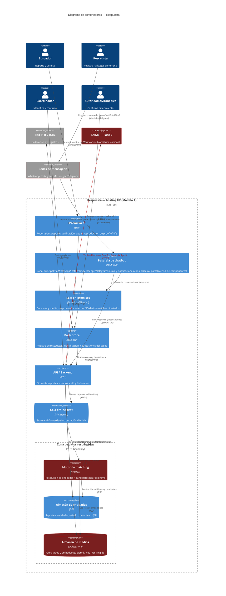

# C4 — Diagrama de Contenedores · Respuesta

> **C4 — Container view · AI-DLC Fase 02 (Design)**
>
> Las unidades desplegables dentro del sistema y cómo se comunican. Todo vive bajo el hosting del
> Modelo A (UE). La zona de datos restringidos (almacén de medios, motor de matching, almacén de
> entidades) se marca como trust boundary interno. En rojo: superficies sensibles (biométricos,
> autenticación, modelo facial, SAIME).

## Notas de seguridad por contenedor

La **API/Backend** concentra autenticación y autorización por rol y por clúster (RS-01, RS-02 →
OWASP A07/A01): ningún canal toca los datos directamente. La **cola offline-first** materializa el
patrón store-and-forward (RF-02) que sostiene la captura en zona de apagón. La **zona de datos
restringidos** agrupa lo que nunca debe salir sin control: el **almacén de medios** (biométricos y
video, cifrado — RS-03/RS-08 → A04) y el **motor de matching**, marcado como superficie de IA por
el riesgo de sesgo facial (RS-13 → `ai-sec`); por eso ninguna fusión por face-match se confirma sin
un humano. La verificación **SAIME** queda fuera del boundary y en rojo: es Fase 2 y se invoca con
mínima divulgación para no filtrar al Estado quién consulta por quién (AB-13).
