# C4 — Diagrama de Contenedores · Respuesta

> **C4 — Container view · AI-DLC Fase 02 (Design)**
>
> Las unidades desplegables dentro del sistema y cómo se comunican. Todo vive bajo el hosting del
> Modelo A (UE). La zona de datos restringidos (almacén de medios, motor de matching, almacén de
> entidades) se marca como trust boundary interno. En rojo: superficies sensibles (biométricos,
> autenticación, modelo facial, SAIME).

```mermaid
C4Container
    title Diagrama de contenedores — Respuesta

    Person(buscador, "Buscador", "Reporta y verifica")
    Person(rescatista, "Rescatista", "Registra hallazgos en terreno")
    Person(coordinador, "Coordinador", "Identifica y confirma")
    Person(autoridad, "Autoridad civil/médica", "Confirma fallecimiento")

    System_Boundary(sys, "Respuesta — hosting UE (Modelo A)") {
        Container(web, "Portal Web", "SPA", "Reporte/autoreporte, verificación, opt-in, reproducción de proof-of-life")
        Container(edge, "Edge / Reverse proxy", "TLS, WAF", "Endpoint público que reciben los webhooks de Meta; termina TLS y limita tasa")
        Container(webhook, "Webhook Gateway de Meta", "Servicio FastAPI", "Borde sin estado: verifica firma, dedup y ACK; publica SOLO el payload crudo a meta.received (no toca workers)")
        Container(metahandler, "Meta Handler", "Worker", "Consume meta.received, crea el evento, normaliza y reparte a inbound.text/inbound.media (ver C4 de componentes)")
        Container(chatbot, "Pasarela de chatbot", "Multi-red", "Canal principal vía WhatsApp/Instagram/Messenger/Telegram; intake y notificaciones con enlaces al portal (ver C4 de componentes)")
        Container(outbound, "Servicio de salida", "Worker", "Envía respuestas a Meta por la Graph API (replies), desacoplado de la recepción")
        Container(dlqworker, "Gestor de DLQ", "Worker", "Consume las DLQ de todas las colas; marca el evento como fallido (EventAction ERR), alerta y habilita reproceso")
        Container(llm, "LLM on-premises", "Modelo self-hosted", "Conversa y media; sin proveedor externo; NO decide matches ni estados")
        Container(backoffice, "Back office", "Web app", "Registro de rescatistas, identificación, notificaciones delicadas")
        Container(api, "API / Backend", "REST", "Orquesta reportes, estados, auth y federación")
        ContainerQueue(queue, "Broker AMQP", "RabbitMQ", "Cola offline-first + meta.received/inbound.text/inbound.media/media.stored/outbound.reply; cada cola con DLX→.dlq y reintentos")
        ContainerDb(idem, "Store de idempotencia", "Redis", "Dedup de reintentos de Meta y rate de tokens")
        ContainerDb(eventstore, "Store de eventos", "BD", "Event + EventAction: trazado por pasos (auditoría)")
        Container(secrets, "Secrets manager", "Vault/KMS", "Tokens de Meta, claves JWE y de cifrado de bóveda")

        Boundary(restringida, "Zona de datos restringidos", "trust-boundary") {
            Container(vault, "Worker de Control de Bóveda", "Worker", "Descarga, escanea (AV/CSAM), cifra (sobre+KMS) y persiste los adjuntos de Meta")
            Container(matcher, "Motor de matching", "Worker", "Resolución de entidades + candidatos near-real-time")
            ContainerDb(db, "Almacén de entidades", "BD", "Reportes, entidades, estados, parentesco (PII)")
            ContainerDb(media, "Almacén de medios (Bóveda)", "Object store", "Fotos, audio, video y embeddings biométricos (Restringido)")
        }
    }

    System_Ext(pfif, "Red PFIF / ICRC", "Federación de registros")
    System_Ext(saime, "SAIME — Fase 2", "Verificación biométrica nacional")
    System_Ext(messaging, "Redes de mensajería", "WhatsApp, Instagram, Messenger, Telegram")
    System_Ext(meta, "Plataforma Meta (Graph API)", "Webhooks de entrada + descarga de medios por media_id")

    Rel(buscador, web, "Reporta, verifica, opt-in", "JSON/HTTPS")
    Rel(rescatista, messaging, "Registra encontrado + proof-of-life (offline)", "WhatsApp/Telegram")
    Rel(meta, edge, "Entrega webhooks (verify + mensajes)", "HTTPS")
    Rel(edge, webhook, "Reenvía tras TLS/WAF", "HTTPS")
    Rel(webhook, idem, "Dedup por message_id", "TLS")
    Rel(webhook, secrets, "Lee app secret y verify_token", "TLS")
    Rel(webhook, queue, "Publica meta.received (crudo)", "AMQP")
    Rel(queue, metahandler, "Entrega meta.received", "AMQP")
    Rel(metahandler, eventstore, "Persiste Event/EventAction", "TLS")
    Rel(metahandler, queue, "Publica inbound.text / inbound.media", "AMQP")
    Rel(queue, chatbot, "Entrega inbound.text", "AMQP")
    Rel(queue, vault, "Entrega inbound.media", "AMQP")
    Rel(vault, meta, "Descarga binario por media_id", "HTTPS")
    Rel(vault, secrets, "Lee token de medios y envuelve DEK (KMS)", "TLS")
    Rel(vault, media, "Guarda cifrado + metadatos", "TLS")
    Rel(vault, queue, "Publica media.stored", "AMQP")
    Rel(queue, matcher, "Entrega media.stored (imagen/video)", "AMQP")
    Rel(chatbot, llm, "Inferencia conversacional (on-prem)", "")
    Rel(chatbot, queue, "Publica outbound.reply", "AMQP")
    Rel(queue, outbound, "Entrega outbound.reply", "AMQP")
    Rel(outbound, meta, "Envía respuesta (Graph API)", "HTTPS")
    Rel(queue, dlqworker, "Entrega dead-letters (todas las *.dlq)", "AMQP")
    Rel(dlqworker, eventstore, "Marca el evento como fallido (EventAction ERR)", "TLS")
    Rel(coordinador, backoffice, "Identifica y confirma matches", "JSON/HTTPS")
    Rel(autoridad, backoffice, "Confirma gravedad/fallecimiento", "JSON/HTTPS")

    Rel(web, api, "Llama", "JSON/HTTPS")
    Rel(chatbot, api, "Envía reportes y notificaciones", "JSON/HTTPS")
    Rel(backoffice, api, "Gestiona casos y transiciones", "JSON/HTTPS")

    Rel(api, queue, "Encola reportes (offline-first)", "AMQP")
    Rel(queue, matcher, "Entrega reportes para resolución", "AMQP")
    Rel(api, db, "Lee/escribe reportes, estados y parentesco", "TLS")
    Rel(api, media, "Guarda fotos y video cifrados", "TLS")
    Rel(matcher, db, "Lee/escribe entidades y candidatos", "TLS")
    Rel(matcher, media, "Lee fotos y embeddings", "TLS")

    BiRel(api, pfif, "Federa registros", "PFIF/HTTPS")
    Rel(api, saime, "Verifica filiación — Fase 2, mínima divulgación", "HTTPS")

    UpdateElementStyle(media, $bgColor="#7a1f1f", $fontColor="#ffffff", $borderColor="#b30000")
    UpdateElementStyle(matcher, $bgColor="#7a1f1f", $fontColor="#ffffff", $borderColor="#b30000")
    UpdateElementStyle(vault, $bgColor="#7a1f1f", $fontColor="#ffffff", $borderColor="#b30000")
    UpdateElementStyle(saime, $bgColor="#7a1f1f", $fontColor="#ffffff", $borderColor="#b30000")
    UpdateElementStyle(messaging, $borderColor="#b30000")
    UpdateElementStyle(meta, $borderColor="#b30000")
    UpdateRelStyle(api, saime, $textColor="#b30000", $lineColor="#b30000")
    UpdateLayoutConfig($c4ShapeInRow="3", $c4BoundaryInRow="1")
```

## Notas de seguridad por contenedor

La **API/Backend** concentra autenticación y autorización por rol y por clúster (RS-01, RS-02 →
OWASP A07/A01): ningún canal toca los datos directamente. El **broker AMQP** materializa el
patrón store-and-forward (RF-02) que sostiene la captura en zona de apagón, con **DLQ y reintentos**
para no perder mensajes. La ingestión de Meta es una cadena **100 % asíncrona vía AMQP**: el **edge/reverse
proxy** expone el único endpoint público (TLS/WAF) y el **Webhook Gateway** valida la firma
`X-Hub-Signature-256` y deduplica reintentos contra el **store de idempotencia** (Redis) — cierra
suplantación de webhooks y duplicados (threat model T1/T11, RS-06). **Convención clave:** el gateway
**no toca ningún worker ni el almacén**; su único salto hacia adentro es publicar el **payload crudo**
a `meta.received`. El **Meta Handler** (worker sin exposición pública) consume ese crudo, crea el
evento, normaliza y resuelve PII, y reparte a `inbound.text`/`inbound.media`. El **store de eventos**
audita por pasos sin exponer contenido (cuerpos JWE). La **zona de datos restringidos**
agrupa lo que nunca debe salir sin control: el **almacén de medios/bóveda** (biométricos y video,
cifrado — RS-03/RS-08 → A04), el **Worker de Control de Bóveda** —que descarga el binario por
`media_id`, **escanea AV/CSAM** (child-safety) y **cifra con sobre+KMS** antes de persistir— y el
**motor de matching**, marcado como superficie de IA por el riesgo de sesgo facial (RS-13 →
`ai-sec`); por eso ninguna fusión por face-match se confirma sin un humano. El **secrets manager**
custodia tokens de Meta y claves JWE/KMS fuera del código. El **servicio de salida** desacopla el
envío de respuestas (Graph API) de la recepción. **Toda cola tiene su DLQ** (DLX→`*.dlq`): el
**Gestor de DLQ** consume los mensajes inprocesables, **marca el evento como fallido** (EventAction
ERR) en el store de eventos y habilita alerta/reproceso, de modo que ningún mensaje se pierde en
silencio y cada fallo queda auditado (RS-06, integridad A08). La verificación **SAIME** queda fuera del boundary
y en rojo: es Fase 2 y se invoca con mínima divulgación para no filtrar al Estado quién consulta por
quién (AB-13). Detalle interno en el [C4 de componentes del webhook](c4-component-webhook.md) y
[ADR-0005](../00-project/adr/0005-webhook-manager-vault-worker.md).
