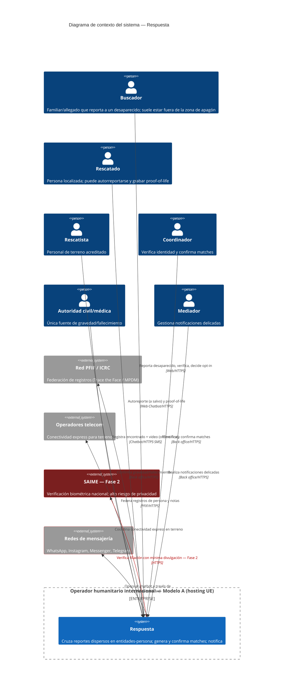

# C4 — Diagrama de Contexto · Respuesta

> **C4 — Context view · AI-DLC Fase 02 (Design)**
>
> El sistema como una sola caja, rodeado de los actores que lo usan y los sistemas externos con
> los que interactúa. El trust boundary marca lo que vive bajo el operador humanitario internacional
> (Modelo A). SAIME aparece en rojo: es de Fase 2 y de alto riesgo de privacidad.

## Relaciones clave

El buscador suele estar conectado (otra ciudad o diáspora) mientras el rescatista opera en la zona
de apagón: por eso la captura del rescatista es **offline-first** y depende de la conectividad
express de los operadores telecom como acelerador, no como requisito. La federación con la red PFIF
es **bidireccional**: Respuesta no es un silo, sino una capa que intercambia con ICRC y similares.
SAIME se relega a Fase 2 y se modela con **mínima divulgación** porque vincular el grafo de
búsqueda al Estado reintroduce el riesgo de persecución que motivó el Modelo A.

El chatbot opera a través de varias **redes de mensajería** (WhatsApp, Instagram, Messenger,
Telegram) sobre un **LLM on-premises** —parte del sistema, sin proveedor externo— que conversa y
media el intercambio entre actores. Las redes de mensajería son los únicos procesadores externos
del medio en tránsito; la regla es no exponerles la carga biométrica: el canal lleva intake y
notificaciones, el proof-of-life se entrega como **link asegurado por login** (no como video en
chat), y el LLM nunca decide matches ni estados. El detalle interno está en el
[C4 de componentes del chatbot](c4-component-chatbot.md).
